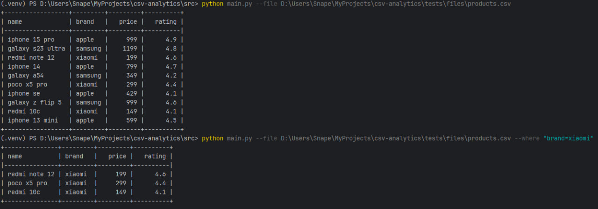
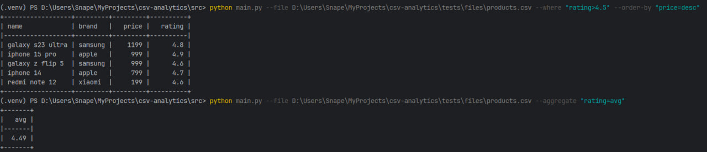
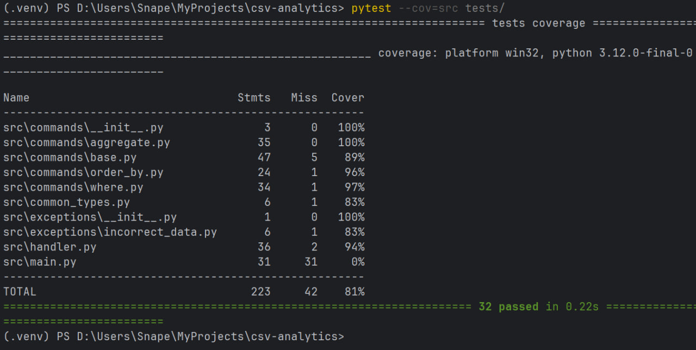

# Обработчик CSV-файлов

## Проект выполнен в рамках тестового задания

### Команды
- --file — полный путь к CSV-файлу (обязательный параметр)
- --where — фильтрация по полю
- --aggregate — агрегация по полю
- --order-by — сортировка по полю

### Примеры использования



### Установка
1) Клонируйте репозиторий:
```sh
git clone https://github.com/XXSnape/csv-analytics.git
```
2) Создайте виртуальное окружение и установите зависимости:
```sh
pip install poetry && poetry install
```

### Тестирование

Для запуска тестов используйте команду, находясь в корне проекта (csv-analytics):
```sh
pytest --cov=src tests/
```
Если все корректно, появится такое сообщение в терминале, означающее, что тесты прошли успешно и можно пользоваться скриптом:
